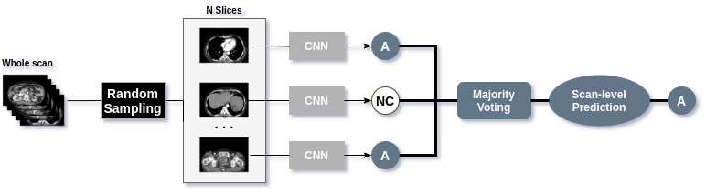

# A Novel Method for Classification of Multi-phase Abdominal CT Scans Using Deep Learning and Random Sampling

This repository contains the training code for our paper entitled "A Novel Method for Classification of Multi-phase Abdominal CT Scans Using Deep Learning and Random Sampling", which was submitted and under review by [Medical Imaging with Deep Learning 2021 (MIDL2021)](https://2021.midl.io/).


## Abstract 
(CT) scans with multiple phases of contrast enhancement requires an accurate classification of the phases.  We propose in this paper a novel method that introduces a random sampling mechanism on top of a convolutional neural network (CNN) for the phase recognition of abdominal CT scans of 3 different phases: non-contrast, arterial, and venous. The CNN works as a slice-wise phase prediction, while the random sampling synthesizes the results over a random subset of the slices. The slice-level classifier is trained on 217,876 slices from 682 CT scans, yielding a mean F1 score of 90.60\% on 79,250  slices of the test set. By majority voting on just 20 slices randomly chosen from each scan, the proposed method achieves a mean F1 score of 93.54\% on 282 samples of the test set.  

## Preprocess DICOM image

 Image read from raw .dcm file needs to be processed as followed:
 
 - Convert pixel values to HU standards using formula: 
 newValue = RescaleSlope * pixelValue + RescaleIntercept 
 > **RescaleSlope** and **RescaleIntercept** can be extracted from the metadata  .dcm file
 - Apply HU window to the image with window_width=400, window_center=50 

## Architecture


## Model training

#### 1.  Data Preparation:

- We preprocess data as mentioned in **Preprocess DICOM image** section
- Training, validating and testing **.csv** file of **2D dataset** should follow this format:

| Study_ID  | Image       			  |  SeriesNumber  			   | Label  |
|-------------|--------------------|--------------------------- |-----|
| Study id    | Path to image    | Extract from metadata | slice label |

- Training, validating and testing **.csv** file of **3D dataset** should follow this format:

| Study_ID  | Image       	     | Label  		|
|-------------|------------------|--------------|
| Study id    | Path to image    | scan label  |
#### 2.  Training Configuration:
Configuration used in the paper are in folder `core/config`
It is  recommended that you change training configuration in .yaml files

Command to train the 2D model:
```
python main.py --config "PATH_TO_CONFIG_FILE"
```
Command to evaluate the 2D model:
```
python main.py --config "PATH_TO_CONFIG_FILE" --load "PATH_TO_MODEL_CHECKPOINT" --mode "VALID_OR_TEST"
```
Command to train the 3D model:
```
python main3d.py --config "PATH_TO_CONFIG_FILE"
```
Command to evaluate the 3D model:
```
python main3d.py --config "PATH_TO_CONFIG_FILE" --load "PATH_TO_MODEL_CHECKPOINT" --mode "VALID_OR_TEST"
```

## Performance 

| Models     | F1 score		    |
|------------|------------------|
| ResNet-18  | 0.9060           |

Table: Slice-wise performance on the our validation set of 79,250 slices from 282 scans

| Models     	   			    | F1 score		  |
|-------------------------------|-----------------|
| Random sampling (30 slices)	| 0.9354          |
| 3DSE (Our implemetation)	    | 0.9043 		  |

Table: Scan-wise performance on the our validation set of 282 scans 